# MyShop
Project in Angular which uses [MyShop API](https://github.com/jaszczurga/MyShopBackend) created in Spring Boot.
This project is a e-commerce website where users can view products, add them to cart and place orders.
MyShop has developed manager panel where
Admin can add, update and delete products and customize them. Admin can also view orders placed by users. 
Website also provides live chat functionality for users to communicate with customer service representatives in real-time.

## Table of Contents
1. [Technologies](#technologies)
2. [Setup](#setup)
3. [Key Features](#key-features)
4. [Live Chat](#live-chat)
5. [Admin Features](#admin-features)
6. [Order Placement](#order-placement)


## Technologies
* Angular 17
* Angular Material
* Bootstrap
* WebSockets
* STOMP
* SOCKJS
* Stripe
* RxJS
* TypeScript
* HTML
* CSS

## Setup

* **Prerequisites:** 
    * Node.js
    * npm
    * Angular CLI
    * running [MyShop API](https://github.com/jaszczurga/MyShopBackend)

1. Clone the repository
```bash
git clone 
```
3. Run the application
```bash
ng serve
```


## Key Features:
* The platform boasts an intuitive and visually appealing user interface, ensuring a smooth navigation experience for customers.

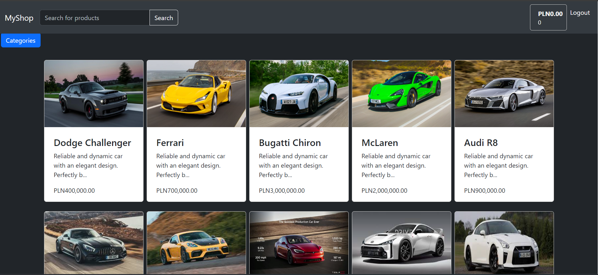

* Users can explore a wide range of products conveniently categorized for easy browsing. Each product is presented with description and images.

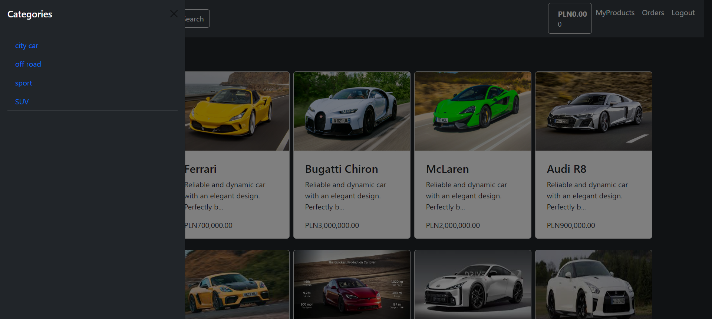
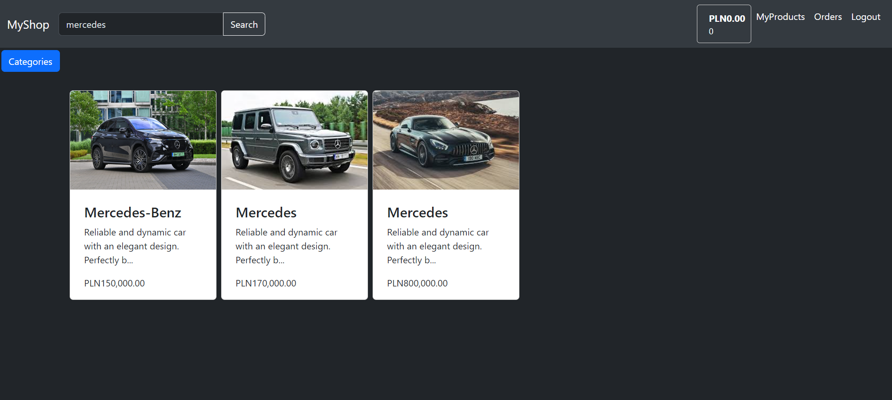

* Customers can add desired items to their shopping cart with a single click. The cart dynamically updates to display the added products, allowing users to review their selections before proceeding to checkout.

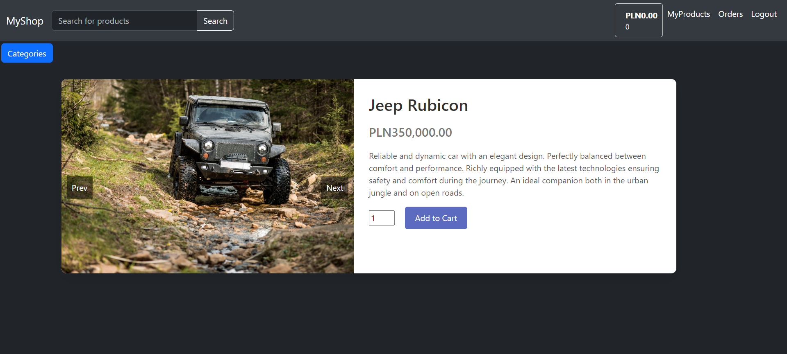

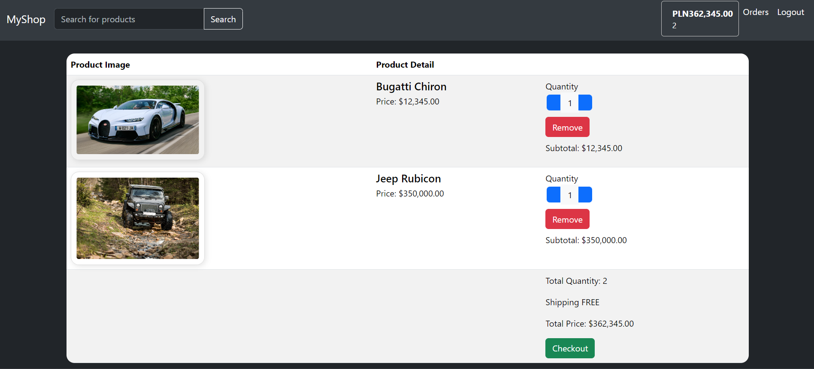

## Live Chat:

* the platform supports live chat functionality, enabling users to communicate with customer service representatives in real-time. Technological advancements such as WebSockets and STOMP provided the foundation for this feature.

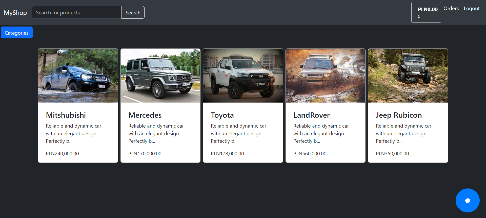

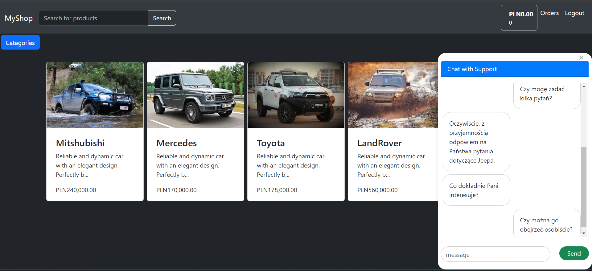

_______________________

## Admin Features:

* Administrators have access to a comprehensive dashboard that empowers them to manage the platform efficiently. From the dashboard, admins can perform actions such as adding new products, updating existing ones, and removing outdated items from the catalog.

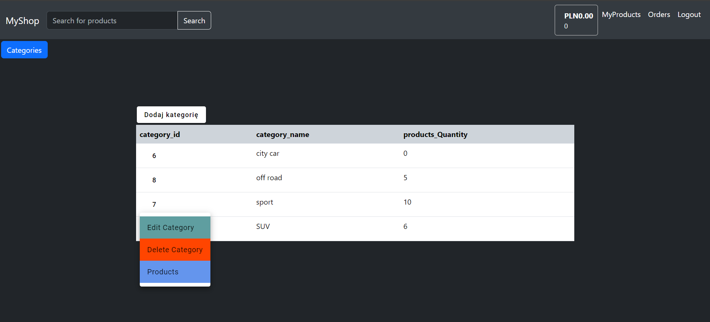

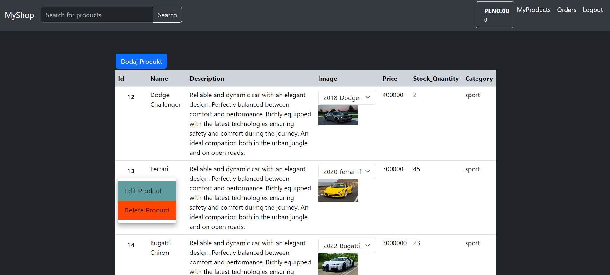

* Administrators can also view all active customers with their live chat history and help them with their orders.

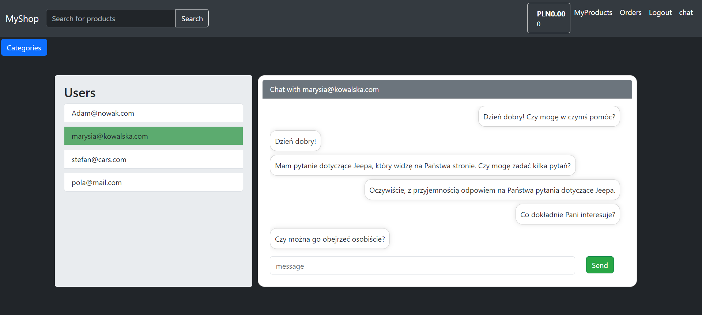

______________________
## Order Placement:

* Payments are powered by well known payment provider Stripe

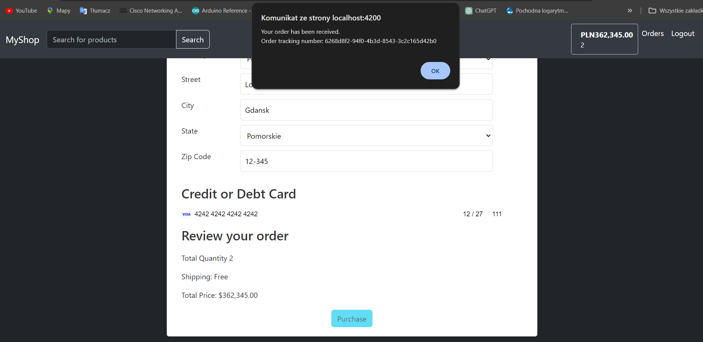

* Users can see their order history and Admin can see all active orders in progress

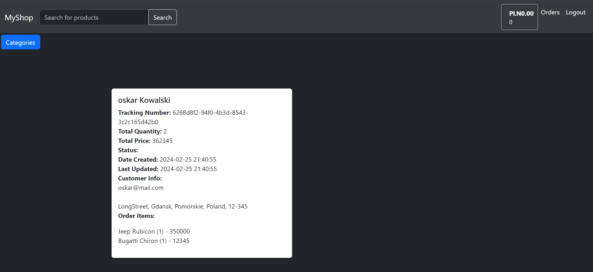

